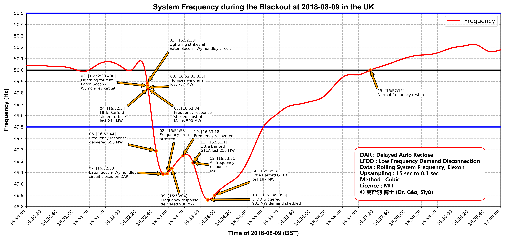

# Frequency and Events of the UK Blackout on 2019-08-09

On August the 9th, 2019 (Friday) afternoon, large parts of England and Wales suffered power cuts, affecting around 1m people and causing widespread disruption to trains and roads ahead of a busy weekend for holiday travel. The power supplies to the trains were not lost, but the supplies to the signallings were.

The National Grid (UK) has released an [interim report](https://www.nationalgrideso.com/information-about-great-britains-energy-system-and-electricity-system-operator-eso) about the event.

This project uses public available frequency data and NG's report to produce an annotated frequency event plot.

## Frequency events on 2018-08-09

See the "requirements.txt" for the Python dependencies.

## License

MIT

## Contributing

**高斯羽 博士** (**Dr. Gāo, Sīyǔ**)